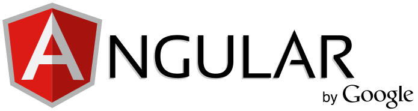

# 
# Introducción

Para aprender Angular con fluidez en estas entradas necesitarás conocimientos básicos de programación con javascript.

En este curso acelerado sobre Angular veremos:
- Conceptos básicos sobre Angular
- Estructura de una aplicación en Angular
- Configuración del entorno de desarrollo
- Construiremos una primera aplicación sencilla
- Revisaremos las distintas versiones de Angular a lo largo de la historia

Esto sentará las bases para que puedas desarrollar aplicaciones web escalables y mantenibles por tu cuenta.

# ¿Qué es Angular?

Angular es un framework MVC (Modelo Vista Controlador) que se ha posicionado como un referente en el desarrollo web Front-End, ya que nos permite construir aplicaciones SPA (Single Page Applications) de forma ágil.

# ¿Por qué necesitamos Angular?

Entre otras cosas Angular nos ofrece:
- Una estructura limpia en nuestras aplicaciones
- Incluye código reusable
- Hace que nuestras aplicaciones sean testeables

# Estructura de una aplicación en Angular

Comunmente una aplicación web actual tendría la siguiente estructura:
- **Front-end**: es la parte del cliente, lo que ve el usuario en su navegador web. Abarca HTML, CSS, JavaScript/TypeScript y Angular.
- **Back-end**: es la parte del servidor web, donde se procesa y se envía la informacion al navegador del usuario. Abarca PHP, Ruby on Rails, Django, Node.js y .NET.
    + **Base de datos**: es donde se guardan los datos que envía el usuario o de donde sacamos los que le queremos mostrar a éste. Pueden ser MongoDB, MySQL, PostgreSQL, Microsoft SQL Server o Apache Cassandra.
    + **APIs**


Los servicios HTTP o API son punto final que son accesibles mediante el **protocolo HTTP**.


# Configurando el entorno de desarrollo 
Necesitaremos instalar **nodejs**, el cual  provee algunas herramientas que necesitamos para contruir aplicaciones en Angular.

http.nodejs.com

``` sh 
$ node --version
v6.10.3

```
La version minima para construir aplicaciones angular es la v.6.9

Una vez que tengamos node NPM instalaremos Angular CLI command line interface
``` sh
$ sudo npm install -g @angular/cli
Password:

```

``` angular
$ ng --version

```

 <script markdown='1' src="https://gist.github.com/gcpmendez/0a428b4ff0c66a226b9b287d6363e512.js"></script>


